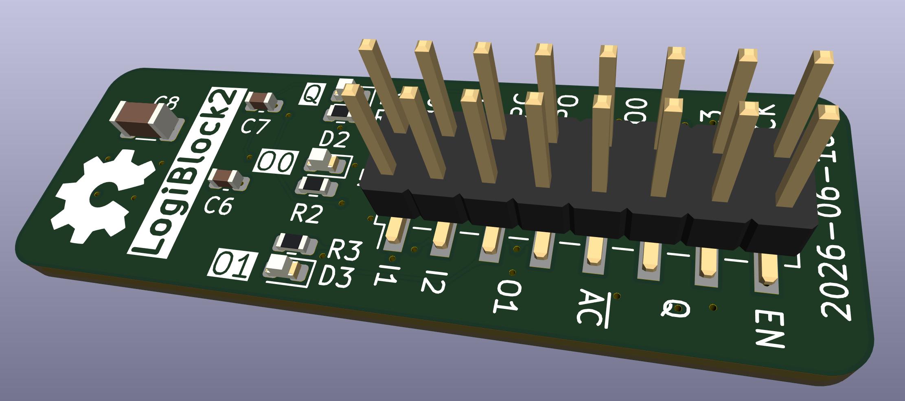
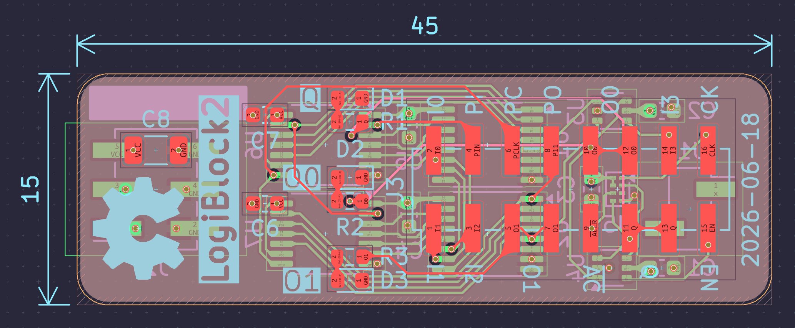

# Logi-Block

A simple, small, FPGA inspired, breadboardable logic cell implemented with discrete SMD components. It is composed of a fracturable 4-input LUT and a D-type flip-flop. It can perform any 4-to-1 or 4-to-2 boolean function and it can optionally store the result in its flip-flop. Logi-Block is programmable serially and can be combined with others to implement any logic circuit.




*Board revision 2*

### Manufacturing

Production files are provided in the releases section. For JLCPCB, the following files can be used:

- ```Logi-Block_2.zip```: ZIP containing the gerber files.
- ```bom.csv```: The bill of materials CSV file.
- ```positions.csv```: The component placement position CSV file.
